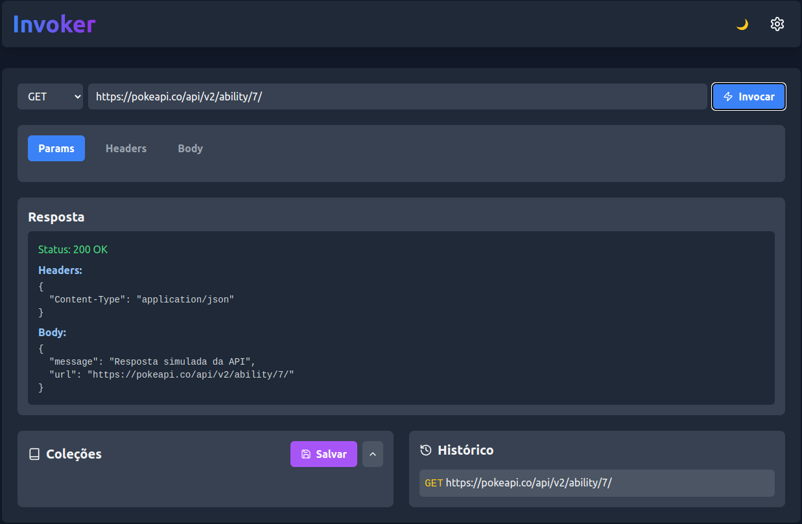

# 🧙‍♂️ Invoker



## 🚀 About The Project

Invoker is a powerful React application built with Vite, offering a seamless and efficient development experience. This project combines modern web technologies to create a fast, responsive, and user-friendly interface.

### 🛠️ Built With

- [React](https://reactjs.org/) - A JavaScript library for building user interfaces
- [Vite](https://vitejs.dev/) - Next Generation Frontend Tooling
- [Tailwind CSS](https://tailwindcss.com/) - A utility-first CSS framework
- [ESLint](https://eslint.org/) - Pluggable JavaScript linter
- [Prettier](https://prettier.io/) - Opinionated Code Formatter

## 🏁 Getting Started

To get a local copy up and running, follow these simple steps.

### Prerequisites

- npm

  ```sh
  npm install npm@latest -g
  ```

### Installation

1. Clone the repo

   ```sh
   git clone https://github.com/felipepimentel/invoker.git
   ```

2. Install NPM packages

   ```sh
   npm install
   ```

3. Start the development server

   ```sh
   npm run dev
   ```

## 🎨 Features

- ⚡️ Lightning-fast HMR (Hot Module Replacement)
- 🎭 JSX support with Fast Refresh
- 🦄 Intuitive project structure
- 🧹 Linting with ESLint
- 💅 Code formatting with Prettier
- 🎠 Routing with React Router
- 🌈 Styling with Tailwind CSS

## 📁 Project Structure

```sh
invoker/
  README.md
  node_modules/
  public/
    favicon.ico
    index.html
  src/
    App.js
    App.css
    App.test.js
    index.js
    index.css
    logo.svg
    reportWebVitals.js
    setupTests.js
  .gitignore
  package.json
  .prettierignore
  .prettierc
  .eslintrc.json
  .env
  .env.development
  .env.production
  .env.test
```

## 🚀 Usage

After starting the development server, you can access the application at `http://localhost:5173`. The project includes two main pages:

- 🏠 Home: Welcoming page of the application
- ℹ️ About: Information about the Invoker project

## 🤝 Contributing

Contributions are what make the open-source community such an amazing place to learn, inspire, and create. Any contributions you make are **greatly appreciated**.

1. Fork the Project
2. Create your Feature Branch (`git checkout -b feature/AmazingFeature`)
3. Commit your Changes (`git commit -m 'Add some AmazingFeature'`)
4. Push to the Branch (`git push origin feature/AmazingFeature`)
5. Open a Pull Request

## 📝 License

Distributed under the Apache License 2.0. See `LICENSE` for more information.

## 🙏 Acknowledgments

- [React Documentation](https://reactjs.org/docs/getting-started.html)
- [Vite Guide](https://vitejs.dev/guide/)
- [Tailwind CSS Documentation](https://tailwindcss.com/docs)
- [ESLint Documentation](https://eslint.org/docs/user-guide/getting-started)
- [Prettier Documentation](https://prettier.io/docs/en/index.html)

Happy coding! 🎉